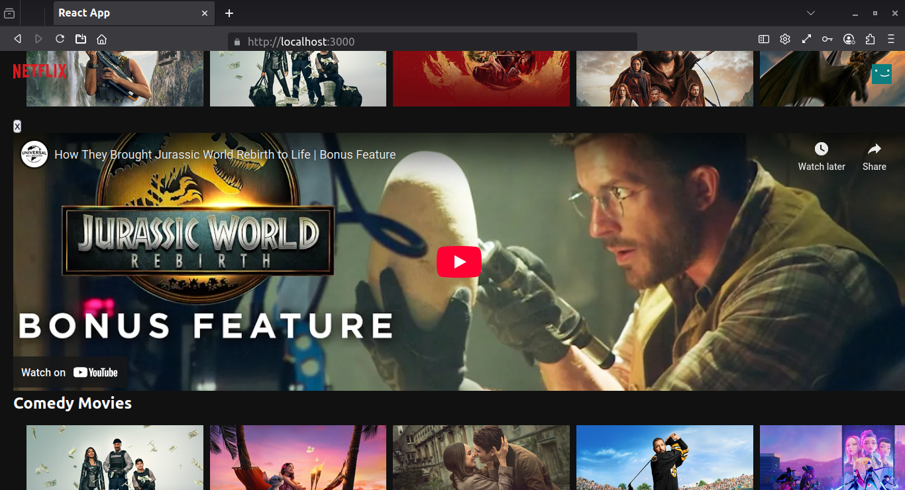

# Netfix UI clone 

I created this project as part of an assignment for a React tutorial.
I used **TMDB** api for data 
One thing i included is you can watch the trailer of the movie 

## install 

<pre>
  <code>
    git clone https://github.com/Akhilesh286/react.netfix-clone.tutorial.git
    cd react.netfix-clone.tutorial
  </code>
</pre>
<pre>
  <code>
    add apikey to the src/constants/urls.js file
  </code>
</pre>
<pre>
  <code>
    npm install
    npm start
  </code>
</pre>
open browser and go to http://127.0.1.1:3000/

## Screenshots 

